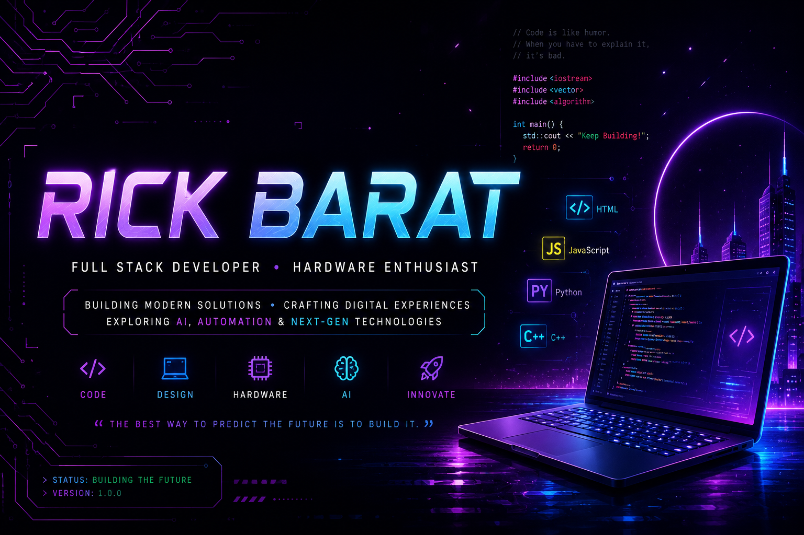

<div align="center">



<br><br>


<br><br>

<p>


</p>

</div>

---

# 👋 About Me

```yaml
Name:
  Rick Barat

Role:
  Full Stack Developer

Secondary Role:
  Computer Hardware Enthusiast

Education:
  Bachelor of Computer Applications

Location:
  India

Currently Working On:
  • Modern Portfolio
  • Full Stack Projects
  • AI Tools
  • UI Design

Currently Learning:
  • React
  • Next.js
  • TypeScript
  • Docker

Interests:
  • Web Development
  • Hardware
  • Automation
  • Artificial Intelligence

Motto:
  "Consistency beats motivation."
```

---

# 🚀 Tech Stack

<div align="center">

### Languages


<br><br>

### Frontend


<br><br>

### Backend


<br><br>

### Database


<br><br>

### Tools


</div>

---

# 📊 GitHub Analytics

<div align="center">


<br><br>


</div>

---

# 🎯 Current Focus

<div align="center">

| 🚀 Building | 📚 Learning | 💡 Exploring |
|-------------|-------------|--------------|
| Portfolio Website | React | AI |
| Full Stack Apps | Next.js | Automation |
| Better UI/UX | TypeScript | Open Source |

</div>

---

# 🌟 Philosophy

> **"Build things that people remember, not things they simply use."**

---
# 🏆 GitHub Achievements

<div align="center">


</div>

---

# 📈 Contribution Activity

<div align="center">


</div>

---

# 🚀 Featured Projects

<div align="center">

| Project | Description | Status |
|:--------:|-------------|:------:|
| 🌐 Portfolio | Modern personal portfolio website | 🚧 |
| 🤖 AI Projects | AI experiments & automation | 🚀 |
| ⚙️ Utilities | Useful tools & scripts | ⭐ |
| 💻 Hardware | PC builds & hardware resources | 🔥 |

</div>

---

# 💡 Currently Working On

```text
🚀 Building beautiful web experiences

⚡ Learning advanced React & Next.js

🤖 Exploring AI & Automation

🎨 Improving UI/UX Design

🌍 Contributing to Open Source
```

---

# 🌌 Developer Philosophy

> **"Build things people remember—not things they simply use."**

---

# 📚 Current Learning

<div align="center">


</div>

---

# ☕ Fun Facts

- 💻 I love building things from scratch.
- 🖥️ Computer hardware is my second passion.
- 🌙 I enjoy late-night coding sessions.
- 🚀 I believe consistency beats motivation.

---
---

# 🌐 Connect With Me

<div align="center">

<a href="mailto:rickbarat21@gmail.com">

</a>

<a href="https://github.com/rickbarat047">

</a>

</div>

---

# ⚡ Quote

<div align="center">

> **"Code is where imagination becomes reality."**

</div>

---
---

# 🐍 Contribution Snake

<div align="center">

<picture>
  <source
    media="(prefers-color-scheme: dark)"
    srcset="https://raw.githubusercontent.com/rickbarat047/rickbarat047/output/github-contribution-grid-snake-dark.svg"
  />
  
</picture>

</div>
<div align="center">

## ⭐ Thanks for visiting my profile!

If you like my work, consider following my journey.


</div>
